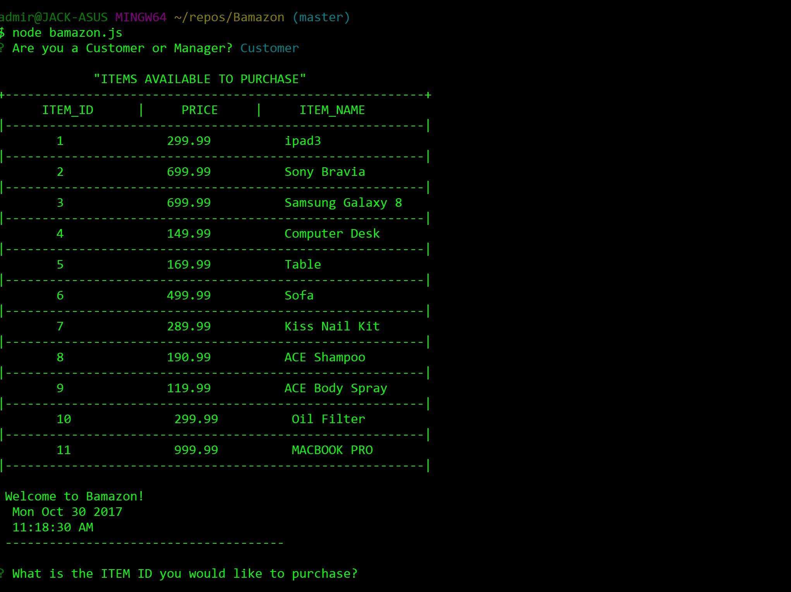

# Bamazon
This app helps customers order products from **Bamazon** and deplete stock from the store's inventory and provide access to managers to *view products for sale*, *view low inventory*, *add to inventory*, *add new products*.

## Customers View
Customers have to choose customer user to order through **Bamazon**

Then **Bamazon** will display all the products are available for sale, welcome customers, display the date and time at the moment of logging and start their order by asking first what's the *item id* that they would like to purchase.

